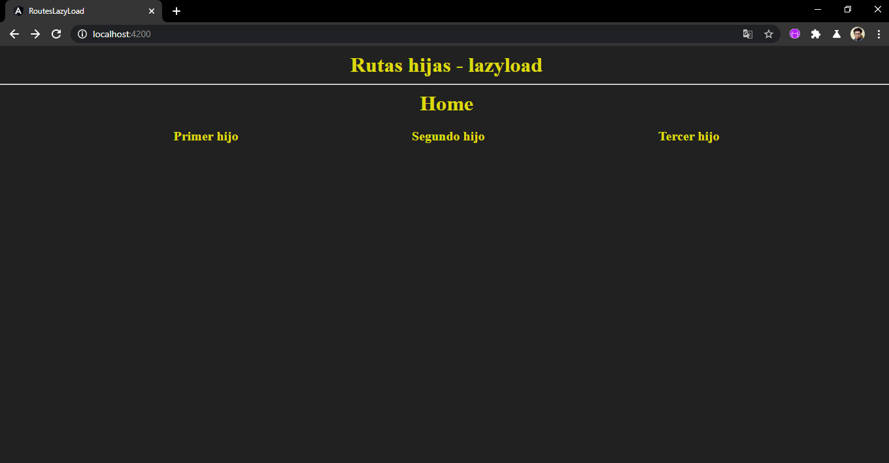
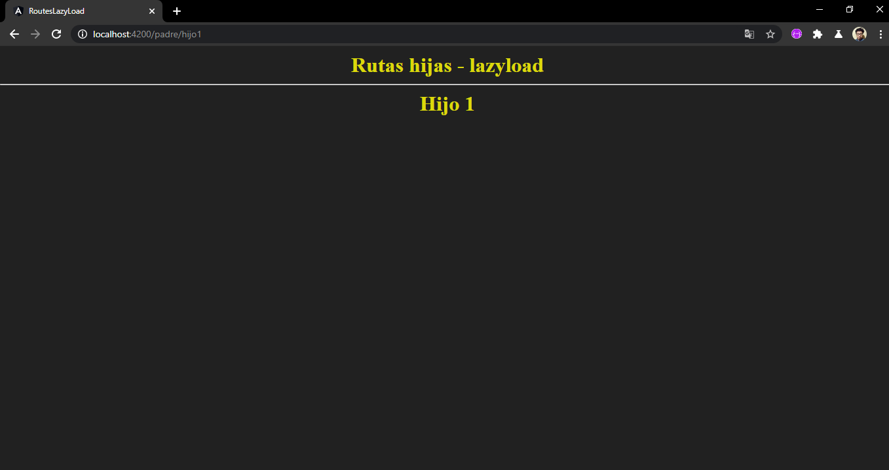
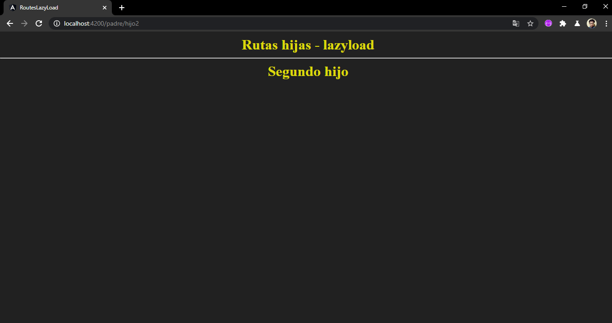
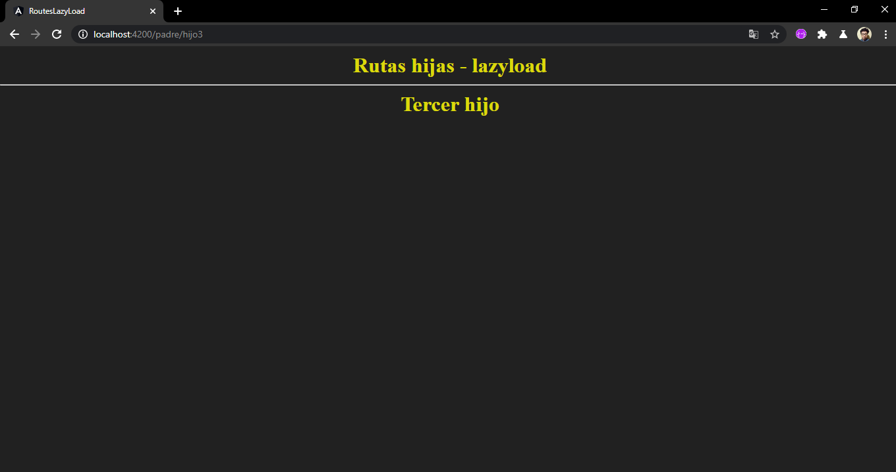
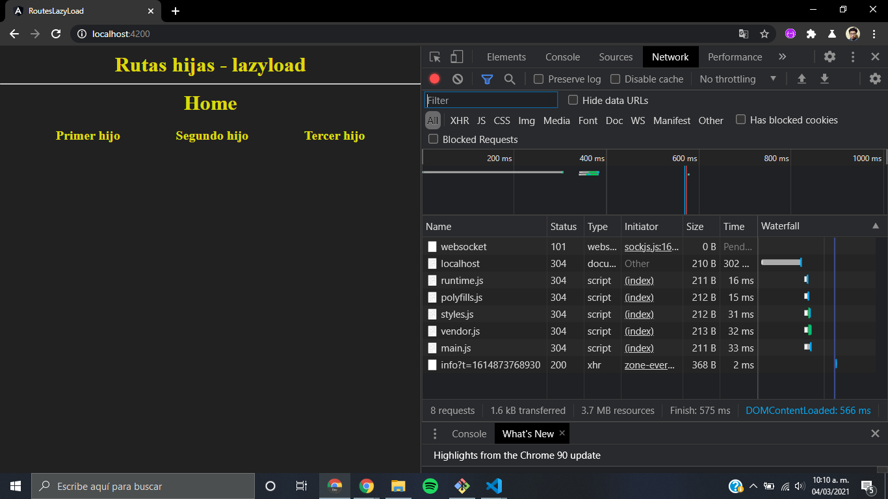
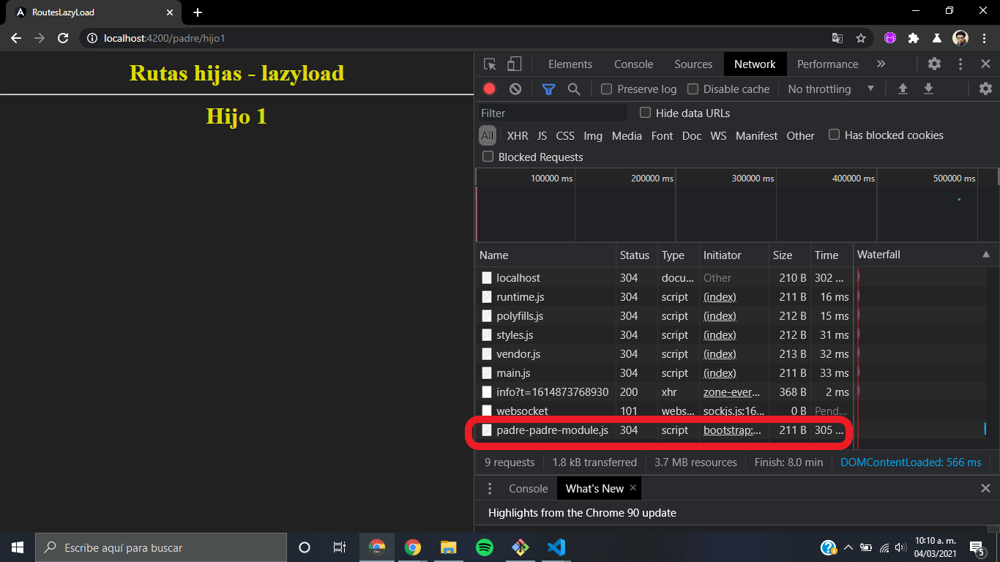

# Rutas, Rutas hijas - Lazy load

El uso de **Lazy load** hace que la aplicacion web sea mas eficiente, ya que evita cargar todos los componentes de la aplicacion de un solo golpe, a solo llamarlos cuando sean necesarios

### Modulos utilizados:

1. RouterModule
2. Routes

## Capturas

